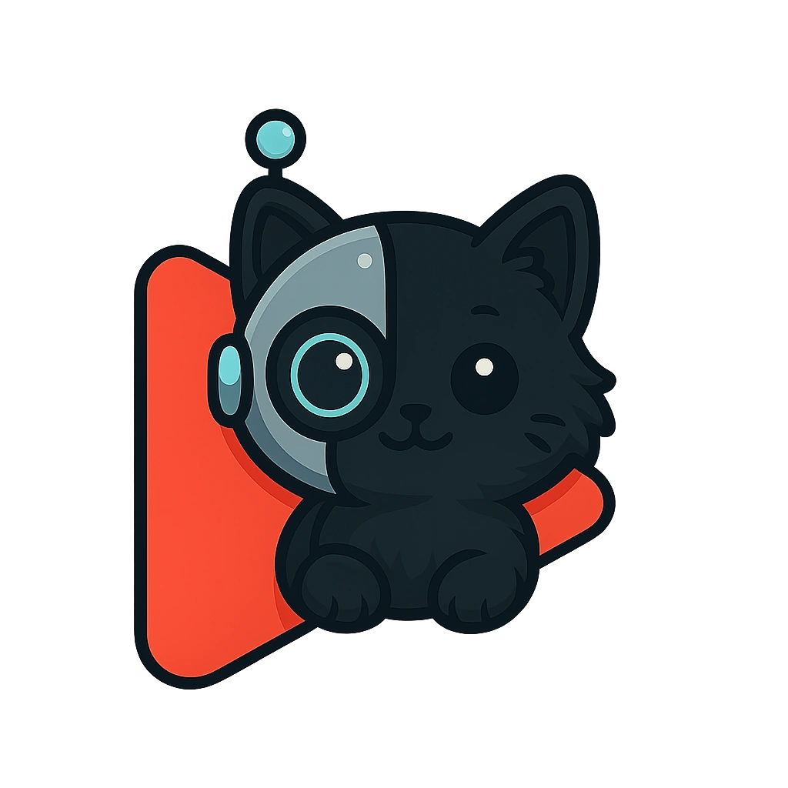

<div align="center">
  
  
  # 🎬 MeowFlix
  
  **Recomendador Inteligente de Filmes com IA**
  
  *Transforme seu humor em recomendações perfeitas de filmes! 🐱*
  
  [](https://app.netlify.com/sites/your-site-name/deploys)
  [](https://reactjs.org/)
  [](https://www.typescriptlang.org/)
  [](https://tailwindcss.com/)
  
  [Demo ao Vivo](https://catbytes.netlify.app) • [Documentação](#-como-usar) • [Reportar Bug](https://github.com/ipierette/meowflix-ai-mood-matcher/issues)
  
</div>

---

## 🌟 Sobre o Projeto

O **MeowFlix** é um recomendador de filmes inteligente que utiliza inteligência artificial para sugerir o filme perfeito baseado no seu humor atual. Combinando o charme felino com a sofisticação do design Netflix-inspired, oferece uma experiência única e personalizada.

### ✨ Principais Características

🤖 **IA Avançada** - Powered by Google Gemini para análise de sentimentos e recomendações precisas  
🎭 **Análise de Humor** - Compreende seu estado emocional e sugere filmes adequados  
🎬 **Dados Reais** - Integração com TMDB para informações atualizadas de filmes  
🎨 **Design Acessível** - Interface otimizada seguindo padrões WCAG AA  
📱 **Responsivo** - Experiência perfeita em desktop, tablet e mobile  
🐱 **Tema Único** - Design elegante com personalidade felina  

---

## 🚀 Tecnologias Utilizadas

<table>
<tr>
<td>

**Frontend**
- React 18.3.1
- TypeScript 5.8.3
- Vite 5.4.19
- Tailwind CSS 3.4.17
- shadcn/ui

</td>
<td>

**Backend & APIs**
- Netlify Functions
- Google Gemini AI
- TMDB API
- Node.js

</td>
<td>

**Ferramentas**
- ESLint
- Autoprefixer
- PostCSS
- Lucide React

</td>
</tr>
</table>

---

## 🎯 Como Funciona

<div align="center">
  
</div>

1. **📝 Input do Usuário**: Descreva como você está se sentindo hoje
2. **🧠 Análise IA**: Google Gemini processa seu humor e sugere um filme
3. **🔍 Busca TMDB**: Encontra dados completos do filme na base de dados
4. **✨ Recomendação**: Exibe sugestão personalizada com poster, sinopse e justificativa

---

## 🛠️ Instalação e Configuração

### Pré-requisitos

- Node.js 18+ 
- Conta no [Google AI Studio](https://ai.google.dev/)
- Conta no [TMDB](https://www.themoviedb.org/)
- Conta no [Netlify](https://netlify.com/)

### 1. Clone o Repositório

```bash
git clone https://github.com/ipierette/meowflix-ai-mood-matcher.git
cd meowflix-ai-mood-matcher
```

### 2. Instale as Dependências

```bash
npm install
```

### 3. Configure as APIs

#### Google Gemini AI
1. Acesse [Google AI Studio](https://ai.google.dev/)
2. Crie uma nova API Key
3. Anote a chave para configuração no Netlify

#### TMDB (The Movie Database)
1. Crie uma conta em [TMDB](https://www.themoviedb.org/)
2. Vá para **Settings > API**
3. Gere um **Bearer Token** (não a API Key)
4. Anote o token para configuração no Netlify

### 4. Deploy no Netlify

1. **Fork/Clone** este repositório para seu GitHub
2. Conecte seu repositório ao **Netlify**
3. Configure as **variáveis de ambiente**:
   ```
   GOOGLE_GEMINI_API_KEY=sua_api_key_aqui
   TMDB_API_TOKEN=seu_bearer_token_aqui
   ```
4. O deploy será **automático** ✨

### 5. Desenvolvimento Local

```bash
# Rodar com Netlify Dev (recomendado)
npx netlify dev

# Ou apenas o frontend
npm run dev
```

---

## 📁 Estrutura do Projeto

```
MeowFlix/
├── 📁 src/
│   ├── 📁 components/          # Componentes React
│   │   ├── 📁 ui/             # Componentes base (shadcn/ui)
│   │   ├── ChatInterface.tsx   # Interface de input
│   │   ├── RecommendationDisplay.tsx  # Exibição de resultado
│   │   ├── Header.tsx         # Cabeçalho
│   │   └── Footer.tsx         # Rodapé
│   ├── 📁 services/           # Integração com APIs
│   │   └── aiService.ts       # Comunicação com Netlify Function
│   ├── 📁 hooks/              # Custom React hooks
│   ├── 📁 assets/             # Imagens e recursos
│   └── 📁 pages/              # Páginas da aplicação
├── 📁 netlify/
│   └── 📁 functions/          # Netlify Functions
│       └── recommend-movie.js  # Função principal da IA
├── netlify.toml               # Configuração do Netlify
└── package.json
```

---

## 🎨 Screenshots

<table>
<tr>
<td width="50%">

**Interface Principal**


</td>
<td width="50%">

**Recomendação Gerada**


</td>
</tr>
</table>

---

## 🌐 Demo e Links

- **🚀 Demo ao Vivo**: [catbytes.netlify.app](https://catbytes.netlify.app)
- **📖 Documentação**: Neste README
- **🐛 Issues**: [GitHub Issues](https://github.com/ipierette/meowflix-ai-mood-matcher/issues)
- **💡 Sugestões**: [GitHub Discussions](https://github.com/ipierette/meowflix-ai-mood-matcher/discussions)

---

## 🤝 Contribuição

Contribuições são muito bem-vindas! Sinta-se à vontade para:

1. 🍴 **Fork** o projeto
2. 🌿 Criar uma **branch** para sua feature (`git checkout -b feature/MinhaFeature`)
3. ✅ **Commit** suas mudanças (`git commit -m 'Adiciona MinhaFeature'`)
4. 📤 **Push** para a branch (`git push origin feature/MinhaFeature`)
5. 🔄 Abrir um **Pull Request**

---

## 📄 Licença

Este projeto está sob a licença MIT. Veja o arquivo [LICENSE](LICENSE) para mais detalhes.

---

## 👩‍💻 Autora

<div align="center">
  <table>
    <tr>
      <td align="center">
        <a href="https://github.com/ipierette">
          
          <br />
          <sub><b>Izadora Pierette</b></sub>
        </a>
        <br />
        <a href="https://github.com/ipierette" title="GitHub">💻</a>
        <a href="https://www.linkedin.com/in/izadora-cury-pierette-7a7754253/" title="LinkedIn">💼</a>
        <a href="https://catbytes.netlify.app" title="Portfolio">🌐</a>
        <a href="https://ko-fi.com/ipierette" title="Ko-fi">☕</a>
      </td>
    </tr>
  </table>
</div>

---

<div align="center">
  
  **Desenvolvido com 💜 e muita ☕**
  
  *Transformando humores em experiências cinematográficas únicas!*
  
  ⭐ **Se este projeto te ajudou, deixe uma estrela!** ⭐
  
</div>